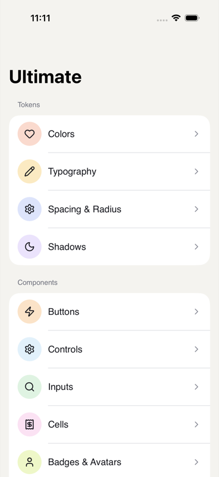
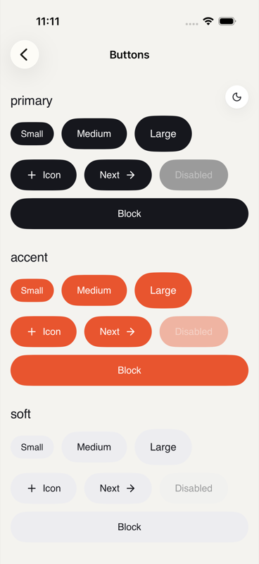
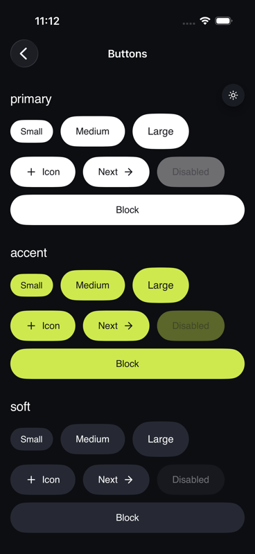
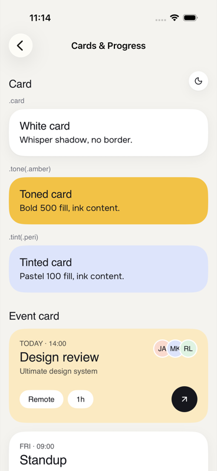
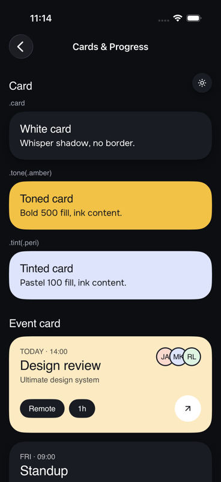
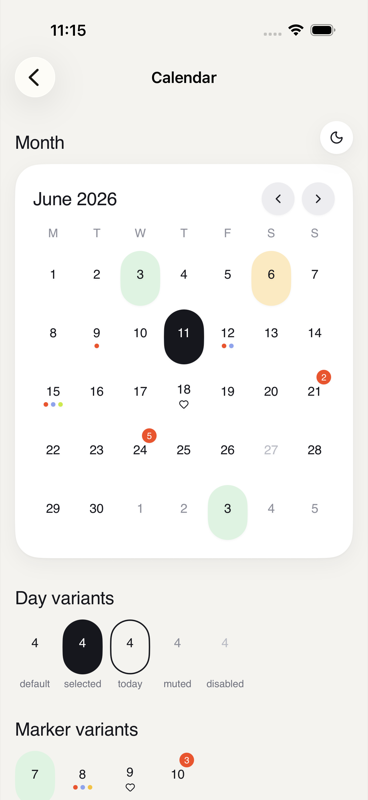
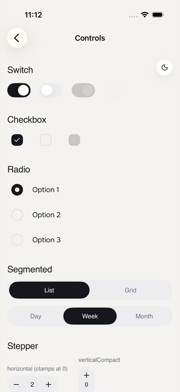
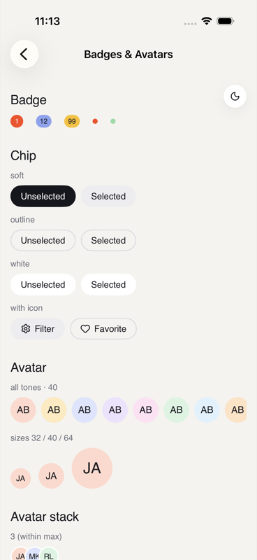
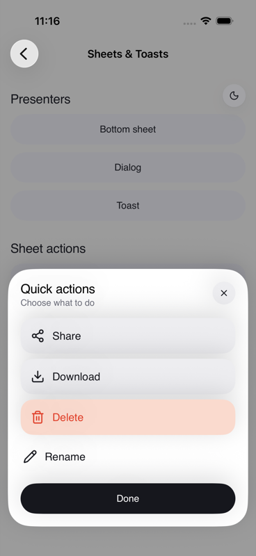

# Ultimate


A SwiftUI design system for iOS — a bold mobile design language built on an
ink-black anchor, warm paper surfaces, candy accent fills, pill geometry
everywhere, and thin-line icons. Light and dark themes out of the box,
33 components, zero configuration.

| | | |
|:---:|:---:|:---:|
|  |  |  |
|  |  |  |
|  |  |  |

- **iOS 17+**, SwiftUI, Swift Package Manager
- Two products: **`Ultimate`** (tokens + components) and **`UltimateGallery`**
  (a ready-made catalog of every component in every state)
- One dependency: [lucide-icons-swift](https://github.com/JakubMazur/lucide-icons-swift)

## Installation

In Xcode: **File → Add Package Dependencies…** and paste the repo URL.

Or in `Package.swift`:

```swift
dependencies: [
    .package(url: "https://github.com/devmobileuae/Ultimate", from: "0.1.0"),
],
targets: [
    .target(name: "MyApp", dependencies: [
        .product(name: "Ultimate", package: "Ultimate"),
    ]),
]
```

## Quick start

```swift
import Ultimate

// Components
UButton("Pay now", variant: .primary, size: .lg, block: true) { pay() }

UCellGroup {
    UCell(icon: "bell", title: "Notifications", value: "On", chevron: true) { open() }
    UCell(icon: "lock", title: "Privacy", showsDivider: false, chevron: true) { open() }
}

// Tokens
Text("Hello, Sandra")
    .uText(.title1)
    .foregroundStyle(UColor.textPrimary)
    .padding(USpacing.s5)
    .background(UColor.surfaceCard, in: .rect(cornerRadius: URadius.xl))
    .uShadow(.card)
```

Every color token is dynamic — light/dark resolves automatically, including
subtree scoping for a single dark screen in a light app:

```swift
WalletScreen()
    .environment(\.colorScheme, .dark)  // lime accents, white inverse pills
```

## Theming

Stock Ultimate needs zero setup. To rebrand, install a `UTheme` once at app
start — every field is optional, anything you don't set keeps the built-in
value. Each override is a light/dark pair:

```swift
@main
struct MyApp: App {
    init() {
        UltimateTheme.configure(UTheme(
            accentPrimary: .init(light: 0xC44569, dark: 0xE58BA3),
            controlActive: .init(light: 0xC44569, dark: 0xE58BA3),
            onControlActive: .init(light: 0xFFFFFF, dark: 0x121020)
        ))
    }
    var body: some Scene { WindowGroup { ContentView() } }
}
```

The theme can also be swapped at runtime (`UltimateTheme.configure` again, or
`.reset()`); colors resolve the active theme at draw time, so attach
`.id(yourThemeToken)` at the root of the themed hierarchy to make SwiftUI
rebuild and pick the new palette up. The gallery's **Theming** page demos this
with live presets.

## Haptics

Every tappable Ultimate component gives haptic feedback out of the box — a
light press on touch-down, and a `.selection` tick on the controls that change
state (switch, checkbox, radio, segmented, stepper, tabs, date strip, bottom
nav, calendar day, dropdown row); destructive rows fire a `.warning`. No setup
required.

Tune it globally, or scope it per subtree:

```swift
// App-wide: disable, or pick a different press feel.
UltimateHaptics.configure(default: .none)     // off everywhere
UltimateHaptics.configure(default: .medium)   // heavier press

// Per subtree — overrides the global default for everything inside.
MyForm()
    .uHaptic(.none)        // silence this screen
SignatureCTA()
    .uHaptic(.heavy)       // emphasize one moment
```

Generators honor the user's system-level haptics setting, and haptics are a
no-op on devices without a Taptic Engine.

## Glass

A frosted-glass surface — ultra-thin material, a faint tint, a hairline rim and
a top highlight — for content over colorful or photographic backdrops. Apply it
to any view with `.uGlass()` (default radius matches cards), or reach for the
built-in glass variants: `UCard(fill: .glass)`, `UButton(variant: .glass)`,
`UIconButton(variant: .glass)`. Glass floats by contrast, so it carries no
shadow.

## Gallery

The full catalog — every token and component, every variant and state, with a
per-page light/dark toggle:

```swift
import UltimateGallery

struct ContentView: View {
    var body: some View { GalleryView() }
}
```

## What's inside

| Group | Components |
|---|---|
| Core | `UIcon` |
| Buttons | `UButton` (7 variants × 3 sizes, incl. `.glass`), `UIconButton` (incl. `.glass`) |
| Controls | `USwitch`, `UCheckbox`, `URadio`, `USegmentedControl`, `UStepper`, `USlider` |
| Inputs | `UInput`, `USearchBar` |
| Cells | `UCell`, `UCellGroup`, `UAgendaRow` |
| Badges | `UBadge`, `UChip`, `UAvatar`, `UAvatarStack` |
| Navigation | `UBottomNav`, `UTopBar`, `UTabs`, `UDateStrip`, `UNavCircle`, `UNavCircleRow` |
| Menus | `UDropdown` |
| Calendar | `UCalendar`, `UCalendarDay` |
| Cards | `UCard`, `UEventCard`, `UStatTile` |
| Sheets | `.uBottomSheet`, `USheetAction`, `.uDialog`, `.uToast` |
| Progress | `UProgressBar`, `UProgressRing` |

Tokens: `UColor` (semantic + 9 candy tones), `UFont`/`UTextStyle` (Onest type
ramp with Dynamic Type), `USpacing`, `URadius`, `USize`, `UShadow`, `UMotion`.

## Known limitations (v0.1)

- `UDropdown`'s floating menu can be clipped by a scrolling ancestor; don't
  clip the host view, or present options in a sheet instead.
- `UDropdown` custom triggers should be non-interactive views (the component
  wraps them in its own button).

## Credits

- Typeface: [Onest](https://fonts.google.com/specimen/Onest), bundled under the
  [SIL Open Font License](Sources/Ultimate/Resources/Fonts/OFL.txt) — a
  stand-in for the brand face; swap point is `UFont`.
- Icons: [Lucide](https://lucide.dev) via
  [lucide-icons-swift](https://github.com/JakubMazur/lucide-icons-swift) (ISC).

## License

MIT — see [LICENSE](LICENSE). Bundled fonts remain under the OFL.
